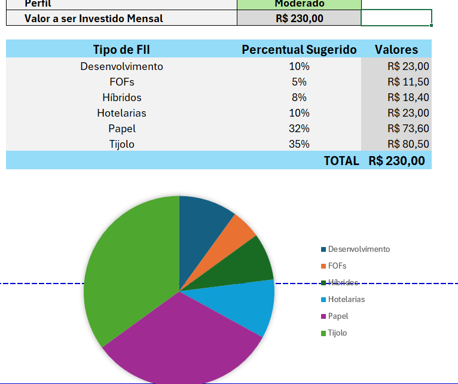
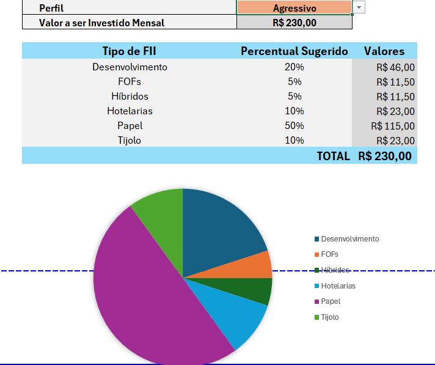

# 📊 Simulador de Investimento em Fundos Imobiliários (FIIs)

Esta ferramenta interativa em Excel foi desenvolvida para simular e projetar o acúmulo de património e o rendimento mensal de dividendos ao investir em Fundos Imobiliários (FIIs), permitindo uma tomada de decisão consciente alinhada ao perfil do investidor.

---

## ❓ As 5 Perguntas de Negócio que a Ferramenta Responde

A planilha foi desenhada no formato de aplicação e responde diretamente às seguintes perguntas:

1. **Quanto investir por mês?** — Usuário pode definir (ex.: `R$ 230,00`).
4. **Por quantos anos?** — Prazo do investimento selecionado pelo utilizador (ex.: `5 anos`).
5. **Qual a taxa de rendimento mensal?** — Taxa esperada de rentabilidade mensal do fundo/carteira (ex.: `1,08% a.m.`).
6. **Quanto de património vai acumular?** — Calculado automaticamente no campo *Património Acumulado* (ex.: `R$ 19.268,69` em 5 anos).
7. **Quanto vai receber de dividendos por mês?** — Estimativa de rendimento mensal recorrente obtida com o património acumulado (ex.: `R$ 171,49/mês`).

---

## 📐 Como a Função VF e o PROCV Entram nos Cálculos
### 2. Uso do PROCV com Chave Composta

O **PROCV** é utilizado para identificar automaticamente o percentual sugerido de alocação para cada categoria de FII (Papel, Tijolo, Híbridos, FOFs, Desenvolvimento e Hotelarias), dependendo do perfil selecionado (Conservador, Moderado ou Agressivo).

* **Chave Composta:** Na aba de apoio `Dados`, foi criada uma coluna de busca que combina o **Perfil** e o **Tipo de FII** (exemplo: `Moderado-PAPEL` ou `Conservador-TIJOLO`).
* **Fórmula do PROCV:**
  ```excel
  =PROCV($C$27 & "-" & B31; Dados!A:D; 4; FALSO)
### 1. Função `VF` (Valor Futuro)
Calcula o montante total acumulado ao final do período com aportes mensais constantes.
* **Fórmula utilizada:**
  ```excel
  =VF(Taxa_Mensal; Qntd_anos * 12; Investimento_Mensal * -1)
  ## 🏷️ Intervalos Nomeados Criados

Para deixar as fórmulas mais limpas, intuitivas e fáceis de ler/manter no Excel, foram configurados os seguintes intervalos nomeados:

* **`Investimento_Mensal`**: Refere-se à célula do aporte mensal informado pelo investidor (utilizado na fórmula do `VF`).
* **`Qntd_anos`**: Refere-se à célula com o prazo do investimento em anos (multiplicado por 12 na fórmula do `VF`).
* **`Taxa_Mensal`**: Refere-se à taxa de rentabilidade mensal esperada.
* **`Rendimento_Carteira`**: Refere-se ao percentual estimado de dividendos mensais da carteira.

---

## 📊 Percentuais de Cada Perfil e de Onde Vieram

Os percentuais foram organizados na aba de apoio `Dados` para distribuir o aporte em 6 categorias de Fundos Imobiliários. Cada perfil totaliza rigorosamente **100%**:

| Tipo de FII | Conservador | Moderado | Agressivo |
| :--- | :---: | :---: | :---: |
| **PAPEL** | 30% | 32% | 50% |
| **TIJOLO** | 50% | 35% | 10% |
| **HÍBRIDOS** | 10% | 8% | 5% |
| **FOFs** | 10% | 5% | 5% |
| **DESENVOLVIMENTO** | 0% | 10% | 20% |
| **HOTELARIAS** | 0% | 10% | 10% |
| **TOTAL** | **100%** | **100%** | **100%** |

### 💡 Origem e Lógica das Percentagens:
* **Conservador:** Dá prioridade a FIIs de **Tijolo (50%)** e **Papel (30%)**, que possuem histórico de receita previsível e menor volatilidade, zerando setores mais arriscados como Desenvolvimento e Hotelarias.
* **Moderado:** Proporciona equilíbrio ao distribuir os aportes entre imóveis físicos, títulos de crédito, FOFs e adicionando parcelas menores (10%) em **Desenvolvimento** e **Hotelarias** para buscar um retorno médio ligeiramente superior.
* **Agressivo:** Concentra 50% em FIIs de **Papel** e destina 20% para **Desenvolvimento** (obras/incorporação), visando maximizar o rendimento de dividendos e o ganho de capital, assumindo maior oscilação de mercado.

---

## ✨ O que foi Mudado em Relação à Ferramenta do Expert

* **Identidade Visual Própria:** Personalização sob a marca/banner **"Santos Investimentos"**, com paleta de cores própria e estilização tipo aplicativo.
* **Seção de Configurações do Investidor:** Inclusão de campos para preenchimento de *Salário Base* e *Rendimento da Carteira*, calculando automaticamente a **sugestão de aporte de 30% do salário**.
* **Projeção de Cenários Expandida:** Tabela comparativa automática projetando o patrimônio e os dividendos para **2, 5, 10, 20 e 30 anos**.
* **Formatação Protegida:** Destaque em cores específicas nas células calculadas para orientar o utilizador sobre quais campos são editáveis e quais contêm fórmulas.
## 📷 Screenshots / Evidências da Ferramenta



